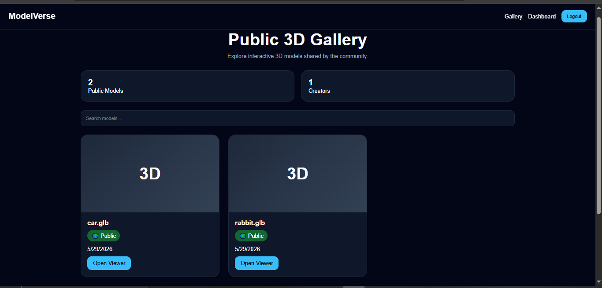
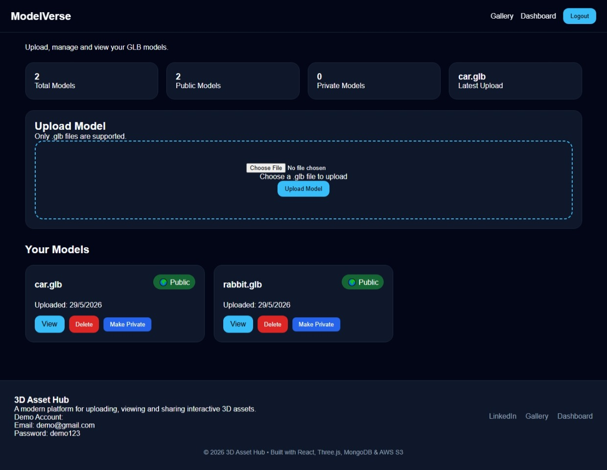
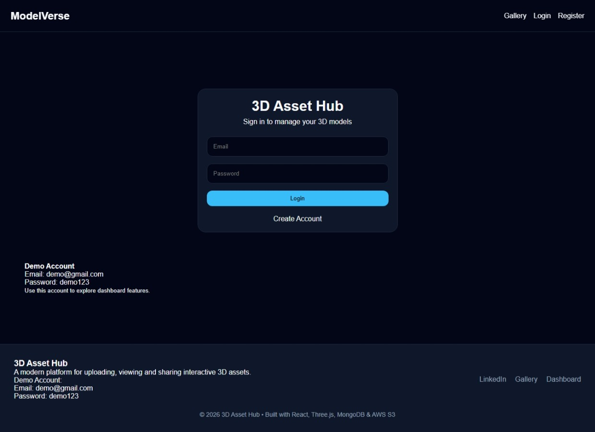
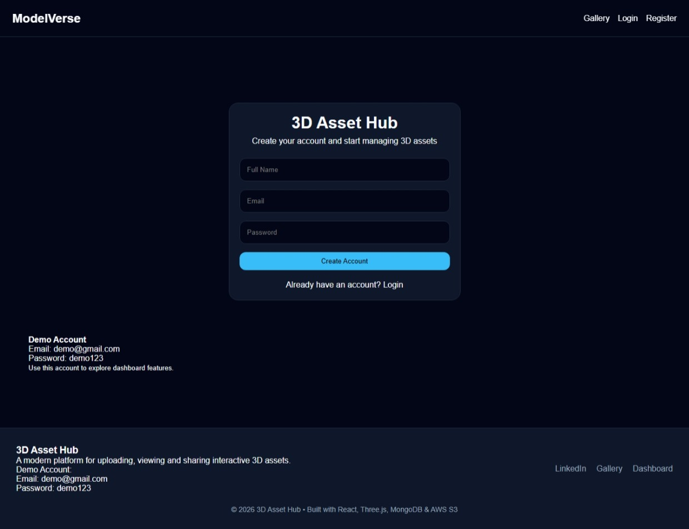
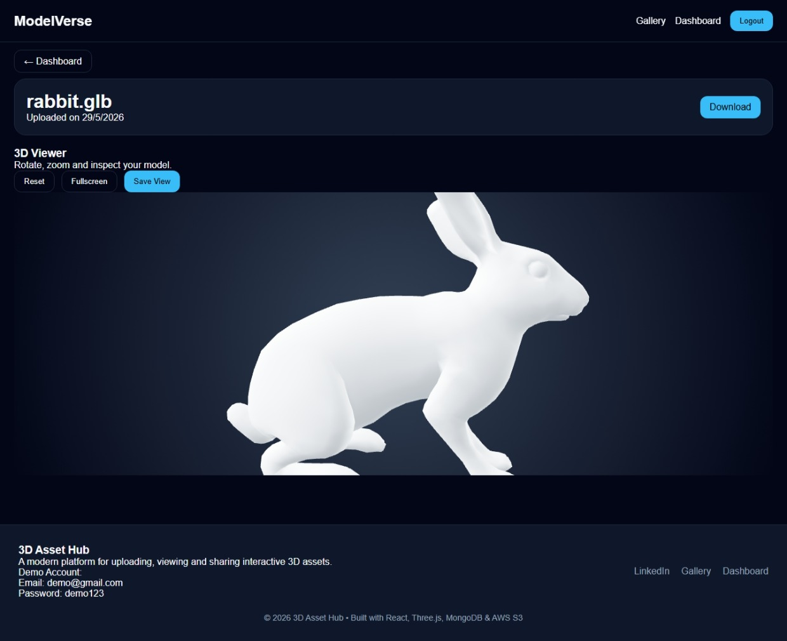

# 🚀 3D Asset Hub
## Live Demo

https://modelverse-ten.vercel.app

A full-stack 3D asset management platform that enables users to upload, manage, visualize, and share interactive 3D models. The platform provides secure authentication, cloud storage, public/private model sharing, and an immersive Three.js-powered 3D viewer.

---

## 📌 Project Overview

3D Asset Hub is designed to solve the challenge of managing and sharing 3D assets online. Users can securely upload GLB models, organize them through a dashboard, interact with them using an advanced 3D viewer, and share selected models publicly through a dedicated gallery.

The project combines modern frontend technologies, scalable backend APIs, cloud storage, and real-time 3D rendering into a complete production-style application.

---

## ✨ Features

### 🔐 Authentication & Authorization

* User Registration
* User Login
* JWT Authentication
* Protected Routes
* Secure API Access
* Session Persistence

### ☁️ Cloud Storage

* AWS S3 Integration
* Secure File Uploads
* Cloud-Based Asset Storage
* Model Deletion Support

### 🎮 Interactive 3D Viewer

* GLB Model Rendering
* Orbit Controls
* Zoom Controls
* Pan Controls
* Fullscreen Mode
* Camera State Persistence
* Responsive Viewer Experience

### 📊 Dashboard

* Personal Model Library
* Upload New Models
* Delete Models
* Toggle Public / Private Visibility
* Dashboard Statistics
* Model Management Interface

### 🌍 Public Gallery

* Browse Public Models
* View Shared Assets
* Responsive Gallery Layout
* Public Viewer Access

### 📱 Responsive Design

* Desktop Support
* Tablet Support
* Mobile Support
* Adaptive Layouts

---

## 🏗️ System Architecture

```text
Frontend (React + Three.js)
            │
            ▼
Backend (Node.js + Express)
            │
            ▼
MongoDB Atlas
            │
            ▼
AWS S3 Storage
```

### Architecture Flow

```text
User Uploads GLB
       │
       ▼
Express API
       │
       ▼
AWS S3 Storage
       │
       ▼
MongoDB Metadata
       │
       ▼
React Dashboard
       │
       ▼
Three.js Viewer
```

---

## 🛠️ Tech Stack

### Frontend

* React
* Vite
* React Router DOM
* Axios
* Three.js
* React Three Fiber
* Drei

### Backend

* Node.js
* Express.js
* MongoDB
* Mongoose
* JWT
* Multer

### Cloud Services

* AWS S3
* AWS IAM

### Database

* MongoDB Atlas

### Deployment

* Vercel (Frontend)
* AWS EC2 (Backend)

---

## 📂 Project Structure

### Frontend

```text
client/
│
├── src/
│   ├── components/
│   ├── pages/
│   ├── api/
│   ├── App.jsx
│   └── main.jsx
│
├── public/
└── package.json
```

### Backend

```text
server/
│
├── config/
├── middleware/
├── model/
├── routes/
├── uploads/
├── server.js
└── package.json
```

---

## 📸 Screenshots

### Public Gallery



### Dashboard



### Login



### Register



### 3D Viewer



---

## 📊 Feature Checklist

| Feature             | Status |
| ------------------- | ------ |
| User Authentication | ✅      |
| JWT Authorization   | ✅      |
| Protected Routes    | ✅      |
| AWS S3 Upload       | ✅      |
| Model Deletion      | ✅      |
| Public Gallery      | ✅      |
| Public Viewer       | ✅      |
| Visibility Controls | ✅      |
| Camera State Saving | ✅      |
| Dashboard Analytics | ✅      |
| Responsive Design   | ✅      |

---

## 🎯 Dashboard Statistics

The dashboard provides:

* Total Models
* Public Models
* Private Models
* Storage Information
* Latest Upload
* Largest Model

---

## 🎥 3D Viewer Features

The integrated Three.js viewer supports:

* GLB File Rendering
* Smooth Camera Controls
* Fullscreen Mode
* Camera State Persistence
* Real-Time Interaction
* Responsive Canvas

---

## ☁️ AWS S3 Integration

Uploaded assets are stored in AWS S3 instead of the application server.

Benefits:

* Scalability
* High Availability
* Cost Efficiency
* Secure File Storage
* Simplified Deployment

---

## 🔒 Security Features

* JWT Authentication
* Protected API Routes
* User Ownership Validation
* Secure S3 Access
* Environment Variable Configuration

---

## 🧪 Demo Credentials

Use the following account to explore dashboard features.

| Field    | Value                                   |
| -------- | --------------------------------------- |
| Email    | [demo@gmail.com](mailto:demo@gmail.com) |
| Password | demo12345                               |

---

## ⚙️ Environment Variables

### Backend (.env)

```env
PORT=5000

MONGO_URI=your_mongodb_connection

JWT_SECRET=your_secret

AWS_ACCESS_KEY_ID=your_access_key

AWS_SECRET_ACCESS_KEY=your_secret_key

AWS_REGION=ap-southeast-2

AWS_BUCKET_NAME=glb-file-store
```

### Frontend (.env)

```env
VITE_API_URL=http://localhost:5000/api
```

---

## 🚀 Local Setup

### Clone Repository

```bash
git clone <repository-url>
```

---

### Backend Setup

```bash
cd server

npm install

npm run dev
```

---

### Frontend Setup

```bash
cd client

npm install

npm run dev
```

---

## 🔮 Future Improvements

* Thumbnail Generation
* Model Search & Filtering
* Favorites & Bookmarks
* Comments & Reviews
* User Profiles
* Model Collections
* Model Versioning
* AR / VR Support
* Drag & Drop Uploading
* CDN Integration

---

## 💡 What I Learned

Through this project I gained hands-on experience with:

* Full-Stack Application Development
* JWT Authentication
* AWS S3 Cloud Storage
* Three.js & React Three Fiber
* MongoDB Data Modeling
* REST API Design
* Responsive UI Development
* Production Deployment Practices

---

## 👨‍💻 Author

### Parshuram Kumar

LinkedIn:
https://www.linkedin.com/in/krparshu/

GitHub:
https://github.com/KrParshuram

---

## ⭐ Support

If you found this project useful, consider giving it a star on GitHub.
